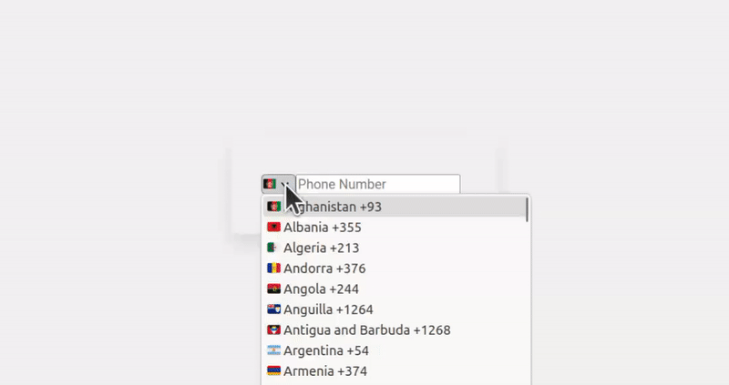

<div align="center">

# 🎡 Input RS 📥

[](https://crates.io/crates/input-rs)
[](https://crates.io/crates/input-rs)

[](https://www.rust-lang.org/)
[](https://www.rust-lang.org)
[](https://github.com/wiseaidev)

[](https://discord.gg/b5JbvHW5nv)


</div>

## 🎬 Yew Demo

| Input Type | Demo                                         |
| ---------- | -------------------------------------------- |
| Text       |          |
| Password   |          |
| Textarea   |  |
| Telephone  |            |

### 📜 Intro

A reusable input component built for WASM frameworks like Yew, Dioxus, and Leptos. It's customizable, accessible, and designed to simplify creating dynamic input fields in your applications.

### 🤔 Why Use It?

1. **🔄 Reusable**: Write once, use anywhere in your app.
2. **🎨 Customizable**: Easily adjust styles and behavior to fit your needs.
3. **✔️ Validations**: Add custom validation functions effortlessly.
4. **🎫 Event Handling**: Supports `oninput`, `onchange`, etc events for dynamic interactions.
5. **♿ Accessible**: User-friendly and built for inclusivity.
6. **❌ Error Handling**: Displays clear error messages for invalid input.

## ⚙️ Installation Yew

You can quickly integrate this Custom Reusable Input Component into your Yew project by following these simple steps:

1. First, make sure you have Yew set up in your project. If not, check out the [Yew documentation](https://yew.rs/docs/getting-started/introduction) for installation instructions.

1. Then, install the input component package using your preferred package manager:

   ```sh
   $ cargo add input-rs --features=yew
   ```

1. Finally, import the component into your Yew application and start using it to power up your forms and user interactions.

### 🛠️ Usage

Using this custom reusable input component is a breeze! Simply follow these steps:

1. Import the component into your Yew application:

   ```rust
   // Add these lines at the beginning of your file, make sure you have `regex` installed for input validation.
   use yew::prelude::*;
   use regex::Regex;
   use input_rs::yew::Input;
   ```

1. Use the `Input` component wherever you need an input field:

   ```rust
   use yew::prelude::*;
   use regex::Regex;
   use input_rs::yew::Input;

   fn validate_email(email: String) -> bool {
       let pattern = Regex::new(r"^[^ ]+@[^ ]+\.[a-z]{2,3}$").unwrap();
       pattern.is_match(&email)
   }


   #[function_component(LoginForm)]
   pub fn login_form() -> Html {
       let input_email_ref = use_node_ref();
       let input_email_handle = use_state(String::default);
       let email_valid_handle = use_state(|| true);
       let onsubmit = Callback::from(move |event: SubmitEvent| {});
       html! {
             <form action="#" aria-label="Sign In Form" onsubmit={onsubmit}>
                 <Input
                   r#type={"text"}
                   handle={input_email_handle}
                   name={"email"}
                   r#ref={input_email_ref}
                   placeholder={"Email"}
                   icon_class={"fas fa-user"}
                   error_message={"Enter a valid email address"}
                   field_class={"form-one-field"}
                   error_class={"error-txt"}
                   required={true}
                   valid_handle={email_valid_handle}
                   validate_function={validate_email}
                 />
             </form>
       }
   }
   ```

1. Customize the input component's appearance and behavior according to your project requirements.

## 🔧 Props

### 🖊️ Input Properties

| Name            | Type           | Description                                                                      | Example                                   | Default Value |
| --------------- | -------------- | -------------------------------------------------------------------------------- | ----------------------------------------- | ------------- |
| `type`          | `&'static str` | The type of the input, e.g., `"text"`, `"password"`, `"tel"`, `"textarea"`, etc. | `"text"`, `"password"`, `"email"`.        | `"text"`      |
| `label`         | `&'static str` | The label to be displayed for the input field.                                   | `"Username"`, `"Email"`.                  | `""`          |
| `name`          | `&'static str` | The name of the input field, used for form submission and accessibility.         | `"username"`, `"email"`.                  | `""`          |
| `required`      | `bool`         | Indicates whether the input is required or not.                                  | `true`, `false`.                          | `false`       |
| `ref`           | `NodeRef`      | A reference to the DOM node of the input element.                                | `use_node_ref()`.                         | -             |
| `error_message` | `&'static str` | The error message to display when there is a validation error.                   | `"Invalid input"`, `"Field is required"`. | `""`          |

### 🎨 Styling Properties

```sh
+-----------------------------+  <-- `class`
|                             |
|  +-----------------------+  |  <-- `label_class`
|  |       Label           |  |
|  +-----------------------+  |
|                             |
|  +-----------------------+  |  <-- `field_class`
|  | +-------+  +--------+ |  |
|  | | Input |  |  Icon  | |  |  <-- `input_class` and `icon_class`
|  | +-------+  +--------+ |  |
|  +-----------------------+  |
|                             |
|  +-----------------------+  |  <-- `error_class` (if invalid)
|  |       Error Message   |  |
|  +-----------------------+  |
+-----------------------------+
```

| Name          | Type           | Description                                                      | Example                                    | Default Value |
| ------------- | -------------- | ---------------------------------------------------------------- | ------------------------------------------ | ------------- |
| `class`       | `&'static str` | The CSS class to be applied to all inner elements.               | `"form-input-container"`, `"input-group"`. | `""`          |
| `field_class` | `&'static str` | The CSS class to be applied to the inner input element and icon. | `"form-input-field"`, `"input-icon"`.      | `""`          |
| `label_class` | `&'static str` | The CSS class to be applied to the label for the input element.  | `"form-input-label"`.                      | `""`          |
| `input_class` | `&'static str` | The CSS class to be applied to the input element.                | `"custom-input"`.                          | `""`          |
| `error_class` | `&'static str` | The CSS class to be applied to the error div element.            | `"input-error-message"`.                   | `""`          |
| `icon_class`  | `&'static str` | The CSS class to be applied to the icon element.                 | `"input-icon"`.                            | `""`          |

### 🧠 State and Callback Properties

| Name                | Type                     | Description                              | Example          | Default Value |
| ------------------- | ------------------------ | ------------------------------------------- | ---------------- | ------------- |
| `handle`            | `UseStateHandle<String>` | The state handle for managing the value of the input.                                               | `use_state(\|\| "".to_string())`. | -   |
| `valid_handle`      | `UseStateHandle<bool>`   | The state handle for managing the validity state of the input.                                      | `use_state(\|\| true)`.           | -   |
| `validate_function` | `Callback<String, bool>` | A callback function to validate the input value. It takes a `String` as input and returns a `bool`. | `Callback::from(\|value\| value.len() > 3)` | -   |

### 👁️ Password Icon Properties

| Name           | Type           | Description                                | Example                            | Default Value                                                                         |
| -------------- | -------------- | ------------------------------------------ | ---------------------------------- | ------------------------------------------------------------------------------------- |
| `eye_active`   | `&'static str` | The icon when the password is visible.     | `"fa fa-eye"` (FontAwesome).       | `"cursor-pointer right-4 top-1 text-2xl text-gray-600 toggle-button fa fa-eye"`       |
| `eye_disabled` | `&'static str` | The icon when the password is not visible. | `"fa fa-eye-slash"` (FontAwesome). | `"cursor-pointer right-4 top-1 text-2xl text-gray-600 toggle-button fa fa-eye-slash"` |

### ♿ Accessibility and SEO Properties

| Name               | Type           | Description                                                                                      | Example                                              | Default Value |
| ------------------ | -------------- | ------------------------------------------------------------------------------------------------ | ---------------------------------------------------- | ------------- |
| `id`               | `&'static str` | The ID attribute of the input element.                                                           | `"input-username"`, `"input-email"`.                 | `""`          |
| `placeholder`      | `&'static str` | The placeholder text to be displayed in the input element.                                       | `"Enter your username"`, `"Type your email"`.        | `""`          |
| `aria_label`       | `&'static str` | The aria-label attribute for screen readers, providing a label for accessibility.                | `"Username input"`, `"Email input"`.                 | `""`          |
| `aria_required`    | `&'static str` | The aria-required attribute for screen readers, indicating whether the input is required.        | `"true"`, `"false"`.                                 | `"true"`      |
| `aria_invalid`     | `&'static str` | The aria-invalid attribute for screen readers, indicating whether the input value is invalid.    | `"true"`, `"false"`.                                 | `"true"`      |
| `aria_describedby` | `&'static str` | The aria-describedby attribute for screen readers, describing the input element's error message. | `"error-message-username"`, `"error-message-email"`. | `""`          |

### 🖼️ Image and Media Properties

| Name     | Type           | Description                                                       | Example                  | Default Value |
| -------- | -------------- | ----------------------------------------------------------------- | ------------------------ | ------------- |
| `src`    | `&'static str` | The address of the image resource for `<input type="image">`.     | `"image.png"`.           | `""`          |
| `alt`    | `&'static str` | The alternative text for `<input type="image">`.                  | `"Submit button image"`. | `""`          |
| `height` | `Option<u32>`  | Height of the input (same as the `height` attribute for ``). | `Some(100)`.             | `None`        |
| `width`  | `Option<u32>`  | Width of the input (same as the `width` attribute for ``).   | `Some(200)`.             | `None`        |

### ⏱️ Date and Number Input Properties

| Name   | Type           | Description                                      | Example                  | Default Value |
| ------ | -------------- | ------------------------------------------------ | ------------------------ | ------------- |
| `min`  | `&'static str` | The minimum value for date, number, range, etc.  | `"2023-01-01"`, `"10"`.  | `""`          |
| `max`  | `&'static str` | The maximum value for date, number, range, etc.  | `"2024-01-01"`, `"100"`. | `""`          |
| `step` | `&'static str` | Incremental values that are valid for the input. | `"1"`, `"0.01"`.         | `""`          |

### 📂 File Input Properties

| Name       | Type           | Description                                                      | Example            | Default Value |
| ---------- | -------------- | ---------------------------------------------------------------- | ------------------ | ------------- |
| `accept`   | `&'static str` | Hint for expected file type in file upload controls.             | `".png, .jpg"`.    | `""`          |
| `capture`  | `&'static str` | Media capture input method in file upload controls.              | `"user"`, `"env"`. | `""`          |
| `multiple` | `bool`         | Boolean indicating whether multiple file selections are allowed. | `true`, `false`.   | `false`       |

## 📙 Examples

Lots of examples we built use it to create even more sophisticated forms like Contact Us forms, multi-step forms, and login forms. If you're curious about how to use it, you can check out [the examples folder](examples) for more information.

## 🤝 Contribution

We welcome contributions from the community to make this input component even better! Feel free to open issues, submit pull requests, or provide feedback. Let's collaborate and create something amazing together!

## 📜 License

This input component is licensed under the `Apache-2.0` License, giving you the freedom to use, modify, and distribute it as you see fit. Please check the [`LICENSE`](LICENSE) file for more details.
